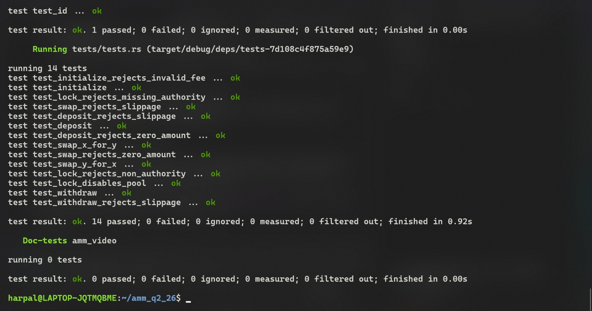

# Solana AMM Program

A constant-product automated market maker (AMM) built on Solana using the Anchor framework. Liquidity providers deposit Token X and Token Y into pool vaults, receive LP tokens representing their share, and traders swap against the pool at prices set by the `x * y = k` invariant. A protocol fee on every swap is split between LPs and a treasury, and an optional pool authority can permanently lock the pool.

---

## Overview

1. **Initializer** creates the pool: a `Config` PDA, an LP mint, and two vault ATAs (one per token). The initializer sets the swap fee (basis points), a protocol **treasury** address, and an optional lock **authority**.
2. **Liquidity providers** call `deposit` to supply Token X + Token Y in the pool's current ratio and receive LP tokens, or `withdraw` to burn LP tokens and reclaim their share of both vaults.
3. **Traders** call `swap` to exchange one token for the other. The input amount (minus fee) moves the constant-product curve; half of the fee stays in the pool as LP yield and half is routed to the treasury ATA of the input mint.
4. If the pool needs to be frozen, the **authority** calls `lock`, permanently disabling deposits, withdrawals, and swaps.

---

## Program Details

- **Program ID**: `6KoUjko5kqLHaF31gdWGBihf8Pw8dUNte2hBpBEJveVe`
- **Framework**: Anchor (Rust)
- **Curve math**: `constant-product-curve` crate (`x * y = k`, 6-decimal precision)
- **Token Support**: SPL Token (`Token`, `transfer`, `mint_to`, `burn`)

---

## Account Architecture & State

### 1. Pool Config (`Config`)

The pool state account holds the parameters and configuration of the market.

| Field | Type | Description |
| :--- | :--- | :--- |
| `seed` | `u64` | Initializer-defined entropy seed allowing multiple concurrent pools |
| `authority` | `Option<Pubkey>` | Admin allowed to lock the pool (`None` = pool can never be locked) |
| `mint_x` | `Pubkey` | Mint address of Token X |
| `mint_y` | `Pubkey` | Mint address of Token Y |
| `fee` | `u16` | Total swap fee in basis points (e.g. `30` = 0.30%, max `10_000`) |
| `treasury` | `Pubkey` | Protocol fee recipient; owner of the `treasury_x` / `treasury_y` ATAs |
| `locked` | `bool` | When `true`, deposit / withdraw / swap are disabled |
| `config_bump` | `u8` | Bump seed used for PDA validation and signer seeds |
| `lp_bump` | `u8` | Bump seed for the LP mint PDA |

### 2. PDA Derivation

- **Config PDA**:
  ```text
  seeds = [b"config", seed.to_le_bytes().as_ref()]
  ```
- **LP Mint PDA**:
  ```text
  seeds = [b"lp", config.key().as_ref()]
  authority = config_pda
  ```
- **Vault Token Accounts**:
  Associated Token Accounts for `mint_x` / `mint_y` owned by the `Config` PDA:
  ```text
  authority = config_pda
  mint = mint_x | mint_y
  ```
- **Treasury Token Accounts** (`treasury_x` / `treasury_y`):
  Associated Token Accounts for `mint_x` / `mint_y` owned by the `treasury` address, created on demand (`init_if_needed`) during `swap`:
  ```text
  authority = config.treasury
  mint = mint_x | mint_y
  ```

### 3. Fees & Treasury

Every swap charges `fee` basis points on the input amount (computed by the constant-product curve):

- **Protocol share (50% of the fee)** is transferred to the treasury ATA of the *input* mint (`treasury_x` for X→Y swaps, `treasury_y` for Y→X swaps).
- **LP share (remaining 50%)** stays in the pool vault, growing `k` to the benefit of all LP holders.

Example: a `10_000_000` input with `fee = 30` bps produces a `30_000` fee — `15_000` goes to the treasury ATA and `9_985_000` lands in the vault. Deposits and withdrawals charge no fee.

---

## Instructions

### 1. `initialize`

Creates the pool: initializes the `Config` PDA, the LP mint PDA, and both vault ATAs.

- **Parameters**: `seed: u64`, `fee: u16`, `authority: Option<Pubkey>`, `treasury: Pubkey`
- **Signer**: Initializer (pays for account creation)
- **Constraints**: `fee` must be `<= 10_000` (`FeePercentErr` otherwise); `treasury` must not be the default pubkey (`InvalidTreasury`).

### 2. `deposit`

Adds liquidity in the pool's current X/Y ratio and mints LP tokens to the provider. The genesis deposit (empty pool) accepts `max_x` / `max_y` verbatim; later deposits derive exact amounts from the requested LP `amount` via `xy_deposit_amounts_from_l` and enforce them against `max_x` / `max_y` slippage limits.

- **Parameters**: `amount: u64` (LP tokens to mint), `max_x: u64`, `max_y: u64`
- **Signer**: Liquidity provider
- **Constraints**: Rejected when the pool is locked (`PoolLocked`); `amount` must be non-zero (`InvalidAmount`); derived deposits breaching `max_x` / `max_y` fail with `SlippageExceeded`.

### 3. `withdraw`

Burns LP tokens and returns the provider's pro-rata share of both vaults, enforcing `min_x` / `min_y` slippage limits.

- **Parameters**: `amount: u64` (LP tokens to burn), `min_x: u64`, `min_y: u64`
- **Signer**: Liquidity provider
- **Constraints**: Rejected when the pool is locked (`PoolLocked`); payouts below `min_x` / `min_y` fail with `SlippageExceeded`.

### 4. `swap`

Trades one token for the other against the constant-product curve with slippage protection:

1. Computes the curve result for the full `amount_in` (fee included in the quote).
2. Splits the input: pool share → vault, protocol share (fee / 2) → matching treasury ATA.
3. Transfers the quoted output from the opposite vault to the trader.

- **Parameters**: `is_x: bool` (input mint side), `amount_in: u64`, `min_amount_out: u64`
- **Signer**: Trader (also pays rent if a treasury ATA is created)
- **Constraints**: Rejected when the pool is locked (`PoolLocked`); `amount_in` must be non-zero (`InvalidAmount`); output below `min_amount_out` fails with `SlippageExceeded`; the `treasury` account must equal `config.treasury` (`InvalidTreasury`).

### 5. `lock`

Permanently locks the pool. Only the `authority` stored on the config can call it; pools initialized with `authority: None` can never be locked.

- **Parameters**: None
- **Signer**: Pool authority
- **Constraints**: Fails if already locked (`AlreadyLocked`), if no authority is set (`NoAuthoritySet`), or if the signer is not the authority (`InvalidAuthority`).

---

## Project Structure

```text
amm_q2_26/
├── Anchor.toml
├── Cargo.toml
├── README.md                       # This file
├── programs/
│   └── amm-video/
│       ├── Cargo.toml
│       ├── src/
│       │   ├── lib.rs              # Program entrypoint and instruction handlers
│       │   ├── state.rs            # Config account struct (fee, treasury, lock)
│       │   ├── constants.rs        # PDA seed definitions
│       │   ├── error.rs            # Custom error enum
│       │   ├── instructions/
│       │   │   ├── mod.rs
│       │   │   ├── initialize.rs   # Pool + vault + LP mint creation, fee/treasury validation
│       │   │   ├── deposit.rs      # Liquidity provision and LP minting
│       │   │   ├── withdraw.rs     # LP burning and pro-rata payout
│       │   │   ├── swap.rs         # Curve swap with treasury fee split
│       │   │   └── lock.rs         # Authority-gated pool lock
│       │   └── instructions.rs
│       └── tests/
│           ├── tests.rs            # LiteSVM integration test suite
│           └── ix_handlers/
│               ├── mod.rs
│               ├── init.rs         # Initialize ix builder
│               ├── deposit.rs      # Deposit ix builder + user funding helper
│               ├── withdraw.rs     # Withdraw ix builder
│               ├── swap.rs         # Swap ix builder (treasury accounts included)
│               └── lock.rs         # Lock ix builder
└── proof/
    └── image.jpeg                   # LiteSVM test verification output
```

---

## Building and Testing

### Prerequisites

- Rust `1.89.0` (see `rust-toolchain.toml`)
- Solana CLI `1.18+`
- Anchor CLI `0.30.1+` (Anchorlang `1.0.1`)

### Build

```bash
anchor build
```

### Test

Unit and integration tests are implemented using `litesvm` and `litesvm-token` for fast in-process SVM verification without running a local validator. Build the program first so `target/deploy/amm_video.so` exists, then run:

```bash
cargo test --package amm-video
```

### Test Coverage

| Test | Instruction(s) | What it verifies |
| :--- | :--- | :--- |
| `test_initialize` | `initialize` | Config fields (seed, fee, treasury, mints, authority, unlocked), empty vaults, zero LP supply |
| `test_initialize_rejects_invalid_fee` | `initialize` | Fee `> 10_000` bps fails |
| `test_deposit` | `initialize` + `deposit` | Vault balances, LP supply, user LP mint, user ATA debits |
| `test_deposit_rejects_zero_amount` | `deposit` | Zero LP amount fails |
| `test_deposit_rejects_slippage` | `deposit` | Deposit breaching `max_x` fails |
| `test_withdraw` | `deposit` + `withdraw` | Pro-rata 20M/20M payout, LP burn, supply decrease |
| `test_withdraw_rejects_slippage` | `withdraw` | Withdraw breaching `min_x`/`min_y` fails |
| `test_swap_x_for_y` | `swap` | Y payout, exact `15_000` treasury fee in `treasury_x`, vault delta |
| `test_swap_y_for_x` | `swap` | X payout, exact `15_000` treasury fee in `treasury_y`, vault delta |
| `test_swap_rejects_slippage` | `swap` | Swap breaching `min_amount_out` fails |
| `test_swap_rejects_zero_amount` | `swap` | Zero input fails |
| `test_lock_rejects_non_authority` | `lock` | Non-authority lock fails, pool stays unlocked |
| `test_lock_disables_pool` | `lock` + all | Authority locks, double-lock fails, deposit/withdraw/swap all rejected |
| `test_lock_rejects_missing_authority` | `initialize` + `lock` | Pool with `authority: None` cannot be locked |

---

## Execution & Test Proof

Integration tests executed successfully against the program binary via LiteSVM:


